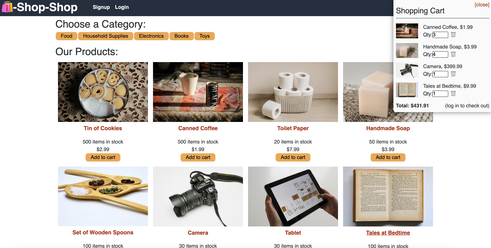

# Rosenblatt Shop Shop
## by Aaron Rosenblatt

### I refactored the code for an e-commerce platform so that it uses Redux instead of React's Context API. Specifically, the platform uses Redux to manage the global state instead of the Context API. I changed the app’s store so that it uses a Redux store instead of the Context API. I also changed the way the React front end accesses the store so it uses a Redux provider. Changes were made to the global state so the app passes reducers to a Redux store instead of using the Context API. Finally, I made changes so the app uses Redux instead of Context API when the app extracts data from the store and dispatches actions. 

### Rosenblatt Shop Shop can be viewed here: https://blatt-shopshop.herokuapp.com/

### The GitHub repository for Rosenblatt Shop Shop can be viewed here: https://github.com/noplur/rosenblatt-shop-shop

### Here is a screenshot of a sample from Rosenblatt Book Search:
### 